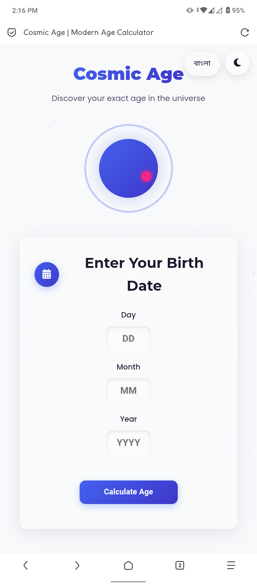

# Cosmic Age Calculator 🌌

A modern, interactive age calculator that shows your age in various cosmic measurements including planetary years, zodiac signs, and life statistics.



## Features ✨

- **Multi-language Support** (English & Bangla)
- **Dark/Light Mode** with automatic system preference detection
- **Detailed Age Calculation** in years, months, days, hours, minutes, seconds
- **Planetary Ages** showing your age on different planets
- **Zodiac Information** including Western and Chinese zodiac signs
- **Life Statistics** with heartbeats, full moons seen, and life progress
- **Fun Facts** about your birth date
- **QR Code Sharing** for easy result sharing
- **Modern UI** with glass morphism, particles background, and smooth animations

## Technologies Used 🛠️

- HTML5, CSS3, JavaScript
- [Particles.js](https://vincentgarreau.com/particles.js/) for interactive background
- [QRCode.js](https://davidshimjs.github.io/qrcodejs/) for generating shareable QR codes
- [Font Awesome](https://fontawesome.com/) for icons
- Google Fonts (Poppins, Montserrat, Hind Siliguri)

## Installation & Usage 🚀

1. Clone the repository:
   ```bash
   git clone https://github.com/msrofficial/cosmic-age-calculator.git
   ```
2. Open `index.html` in your browser
3. Enter your birth date and explore your cosmic age!

## Live Demo 🌍

[View Live Demo](https://cosmic-age-calculator.vercel.app)

## Customization 🎨

You can easily customize:

- Colors in `:root` CSS variables
- Language translations in the JavaScript file
- Particle effects in the particles.js configuration
- Add more zodiac/birthstone information

## License 📄

This project is licensed under the MIT License - see the [LICENSE](LICENSE) file for details.
